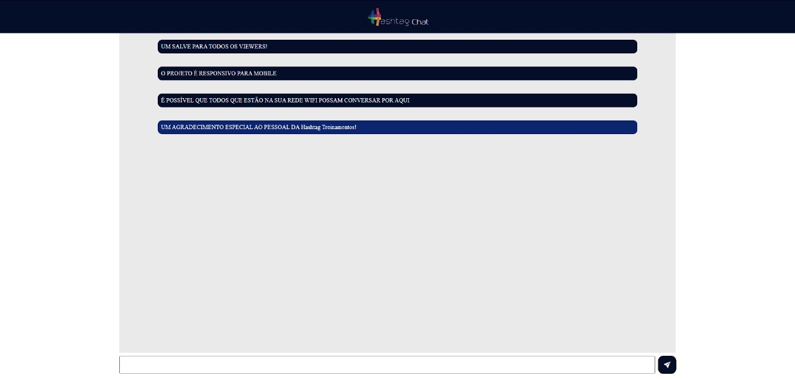

# Chat em tempo real

Chat em tempo real feito em Javascript e Node.js + express

# Print do chat real

# Como usar

1. Clone o repositório
2. Instale as dependências com `npm install`
3. Inicie o servidor com `node --watch ./server.js`
4. Abra o seu navegador com `localhost:4040`

# Como conversar com várias pessoas estando no mesmo WiFi

1. Abra o prompt de comando e digite `ipconfig`
2. Copie o número que corresponde ao IPv4. Geralmente começa com '192.168'...
3. Abra o arquivo `server.js`
4. Troque nessa linha de código `servidorHTTP.listen(4040)` para: `servidorHTTP.listen(4040, "COLE_AQUI_O_SEU_IPv4")`
5. Abra o seu navegador com `SEU_IPv4_AQUI:4040`
